# Лабораторна робота №7: Дослідження фільтра Калмана

## Мета роботи
Дослідити принципи роботи та практичне застосування фільтра Калмана, вивчити особливості його налаштування та вплив різних параметрів на ефективність фільтрації сигналів.

## Теоретичні відомості
Фільтр Калмана представляє собою рекурсивний алгоритм, який використовується для оптимальної оцінки стану динамічної системи на основі зашумлених вимірювань. Основний принцип роботи фільтра полягає у послідовному оновленні оцінки стану системи з урахуванням нових вимірювань та передбачень, зроблених на основі математичної моделі системи. Фільтр враховує статистичні характеристики шумів процесу та вимірювань, що дозволяє досягти оптимального балансу між точністю та швидкістю реакції на зміни в системі.

## Розробка системи дослідження
У розробленій системі реалізовано інтерактивний веб-інтерфейс для дослідження роботи фільтра Калмана. Система дозволяє в реальному часі змінювати параметри фільтра та спостерігати за їх впливом на якість фільтрації. Користувач може налаштовувати матриці коваріації шуму процесу та вимірювань, початкові умови системи, параметри вхідного сигналу та часові характеристики моделювання.

## Результати дослідження

### Базова конфігурація системи
У початковому стані система демонструє роботу фільтра з базовими параметрами, де добре видно три основні складові: істинний сигнал (синя лінія), зашумлений вхідний сигнал (помаранчева лінія) та відфільтрований сигнал (зелена лінія). Дисперсія шуму до фільтрації становить приблизно 16.42, а після фільтрації зменшується до 4.31, що свідчить про ефективність базових налаштувань фільтра.

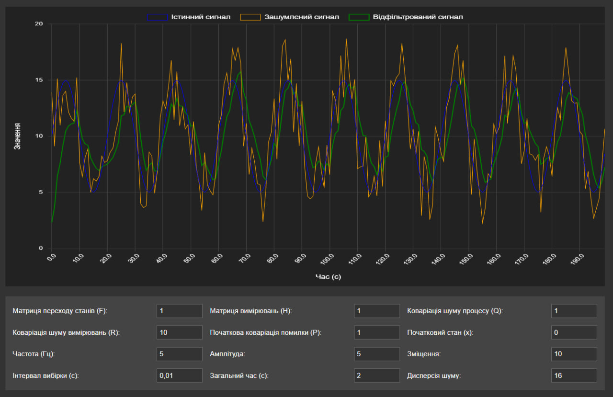

### Дослідження впливу коваріації шуму процесу (Q)
При зменшенні коваріації шуму процесу до Q=0.1 фільтр демонструє більш консервативну поведінку. Система приділяє менше уваги новим вимірюванням, що призводить до більш плавної фільтрації, хоча й може спричинити певне відставання при різких змінах сигналу. Дисперсія шуму після фільтрації значно зменшується, що вказує на високу ефективність згладжування.

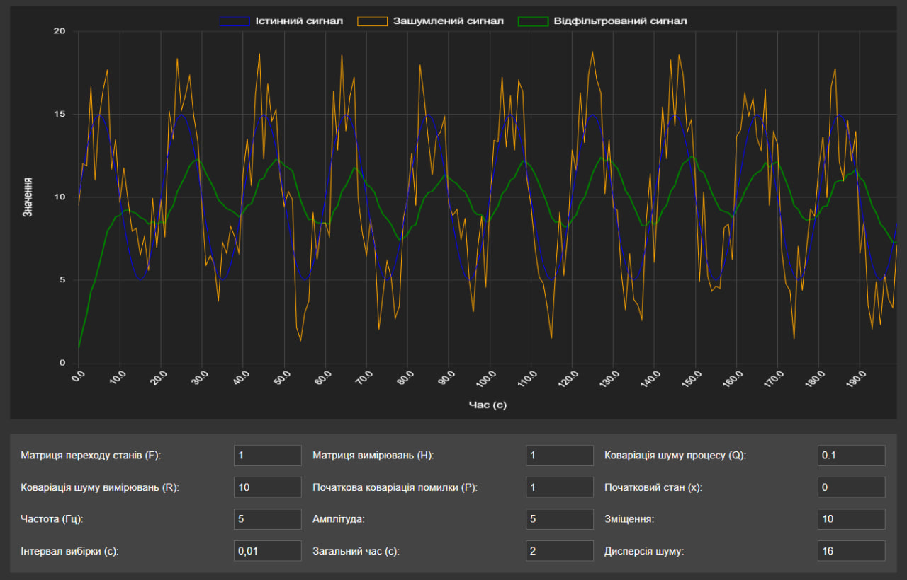

Збільшення коваріації шуму процесу до Q=100 призводить до протилежного ефекту. Фільтр стає більш чутливим до змін вхідного сигналу, швидше реагуючи на нові вимірювання. Це забезпечує краще відстеження динамічних змін, але призводить до меншого згладжування шуму, що видно з підвищеної дисперсії вихідного сигналу.

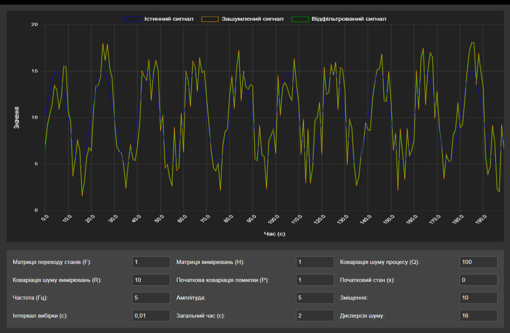

### Дослідження матриці коваріації шуму вимірювань (R)
При встановленні низького значення коваріації шуму вимірювань R=0.5 фільтр починає більше довіряти вхідним даним. Це призводить до більш точного відстеження динамічних змін сигналу, але робить систему більш чутливою до шумів вимірювань. На графіку помітно, як відфільтрований сигнал активніше реагує на короткочасні коливання вхідного сигналу.

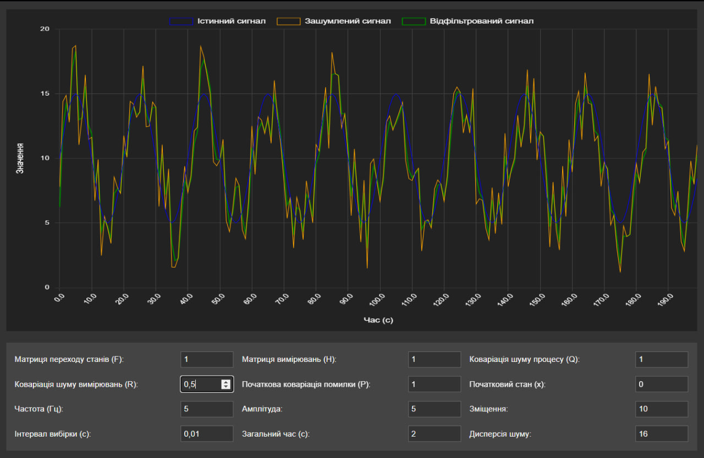

Збільшення значення R до 200 змінює характер роботи фільтра на протилежний. Система значно менше довіряє вимірюванням, що призводить до більш інерційної поведінки фільтра. Відфільтрований сигнал стає більш гладким, але може суттєво запізнюватися при відстеженні реальних змін у сигналі. Це особливо помітно при різких змінах вхідного сигналу.

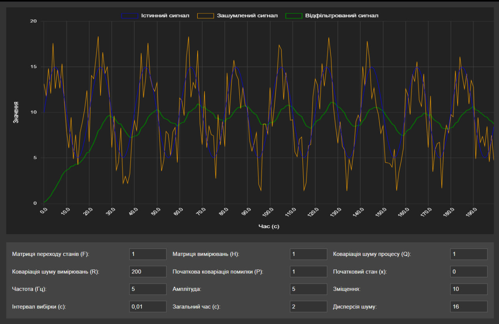

### Дослідження початкової матриці коваріації (P)
При зменшенні початкової коваріації до P=0.01 фільтр демонструє високу впевненість у початковому стані системи. Це призводить до повільнішої адаптації на початковому етапі роботи, оскільки система менше корегує свої оцінки на основі нових вимірювань. Такий режим роботи може бути корисним, коли початковий стан системи добре відомий.

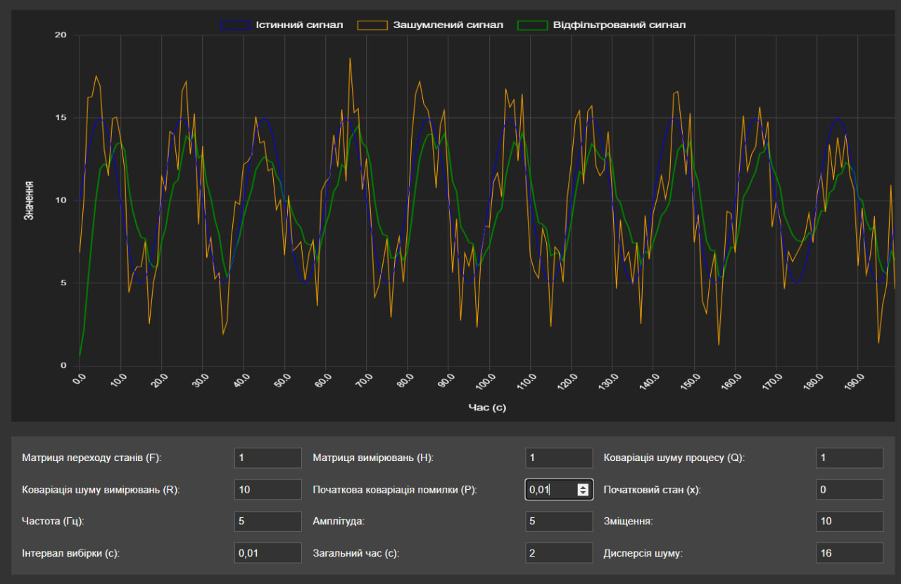

Збільшення початкової коваріації до P=100 відображає значну невпевненість у початковому стані. Фільтр проявляє більш активну корекцію на початку роботи, швидко адаптуючись до реального сигналу. На графіку помітно, як система швидко знаходить правильну траєкторію, навіть якщо початкові оцінки були неточними.

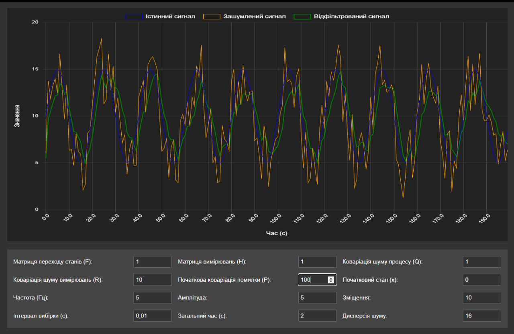

### Дослідження впливу початкового стану системи (x)
При встановленні заниженого початкового стану x=-10 можна спостерігати процес збіжності фільтра до реального сигналу з нижньої межі. Система демонструє здатність швидко адаптуватися та коригувати свої оцінки, незважаючи на значне початкове відхилення.

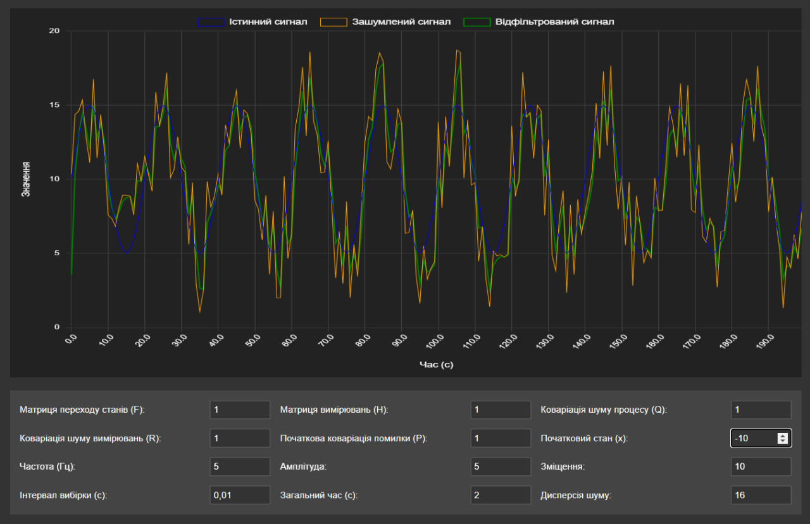

При завищеному початковому стані x=20 фільтр показує аналогічну здатність до адаптації, але вже з верхньої межі. Це підтверджує робастність фільтра щодо неточностей у початкових умовах та його здатність швидко виходити на правильний режим роботи.

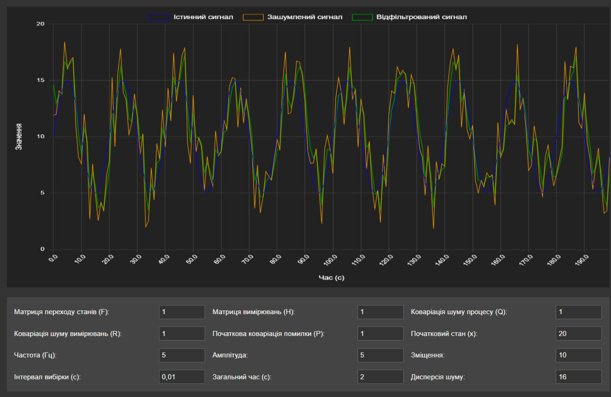

### Дослідження постійної складової сигналу (offset)
Зменшення зміщення до offset=0 дозволяє оцінити роботу фільтра при від'ємному зсуві сигналу. Фільтр зберігає свої характеристики фільтрації незалежно від рівня сигналу, що підтверджує його лінійні властивості.

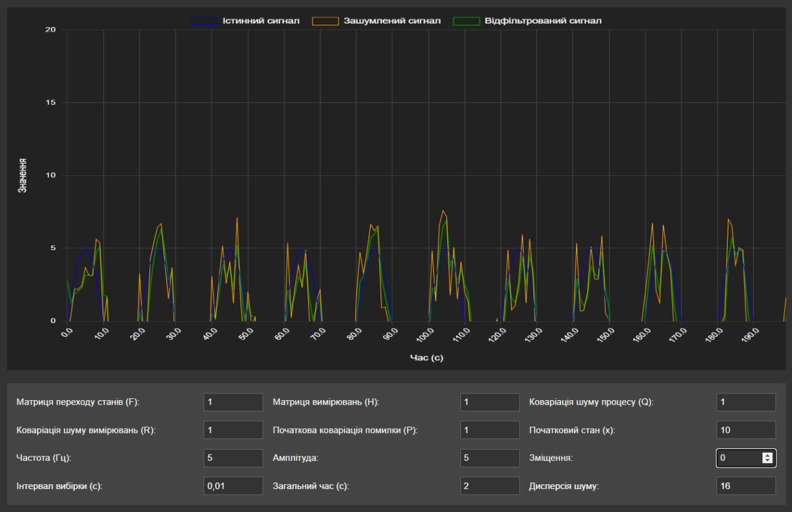

Збільшення зміщення до offset=15 також не впливає на якість фільтрації. Система однаково ефективно обробляє сигнал незалежно від його постійної складової, що є важливою властивістю для практичного застосування.

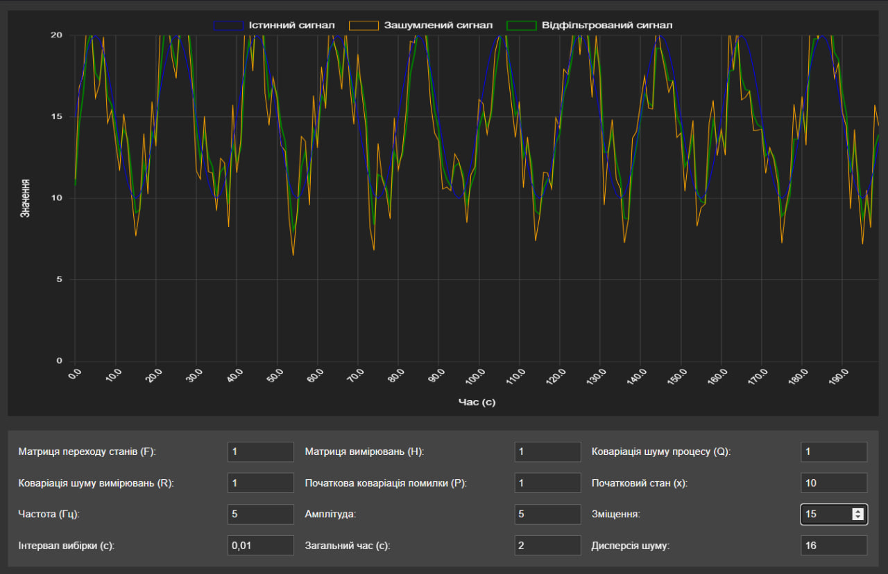

### Дослідження часу моделювання (total_time)
При короткому часі моделювання total_time=0.5 можна спостерігати початкову фазу роботи фільтра, де проявляються особливості його налаштування та швидкість початкової адаптації.

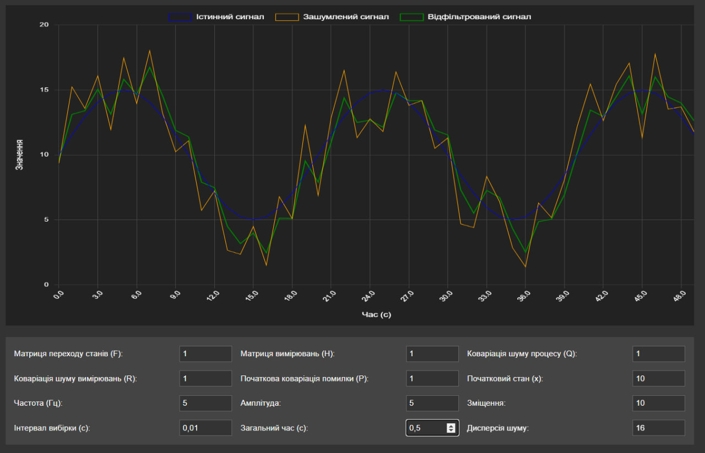

Збільшення часу моделювання до total_time=5 дозволяє оцінити довгострокову стабільність роботи фільтра. На тривалому інтервалі часу стає більш помітною здатність системи підтримувати стабільні характеристики фільтрації та відсутність накопичення помилок.

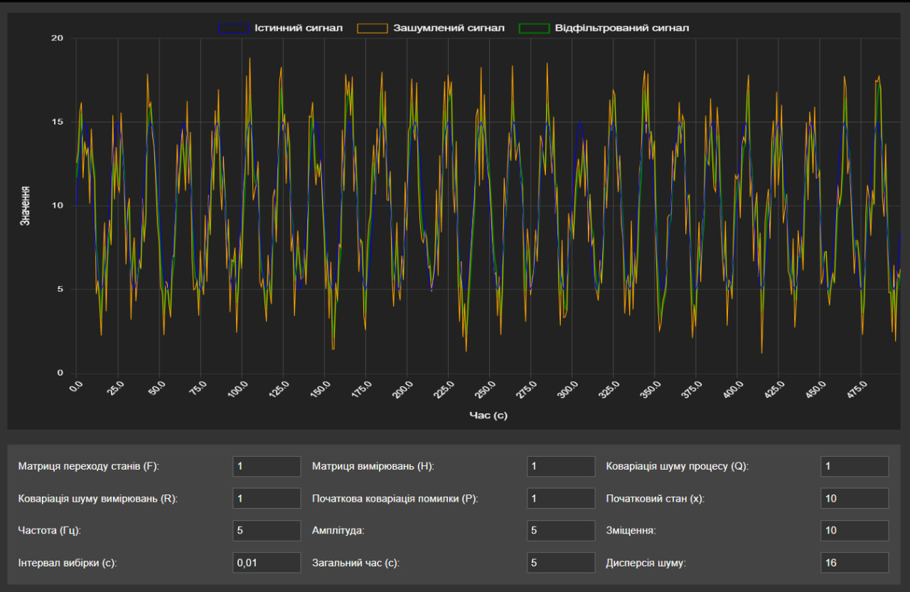

## Висновки

Проведене дослідження роботи фільтра Калмана показало значну залежність його характеристик від налаштування параметрів системи. Коваріація шуму процесу (Q) визначає баланс між швидкістю реакції та якістю фільтрації: малі значення забезпечують краще згладжування, а великі - швидше відстеження змін сигналу. Коваріація шуму вимірювань (R) впливає на рівень довіри до вхідних даних, де низькі значення призводять до активнішого відстеження сигналу, а високі - до кращого згладжування шумів.

Початкові параметри системи (P та x) впливають переважно на початкову фазу роботи фільтра, при цьому система демонструє хорошу збіжність незалежно від початкових умов. Тестування при різних рівнях зміщення сигналу та часових інтервалах підтвердило стабільність роботи фільтра та його придатність для практичного використання в різних умовах.

Отримані результати дозволяють обирати оптимальні параметри фільтра залежно від конкретної задачі, забезпечуючи необхідний компроміс між точністю та швидкістю обробки сигналу.
